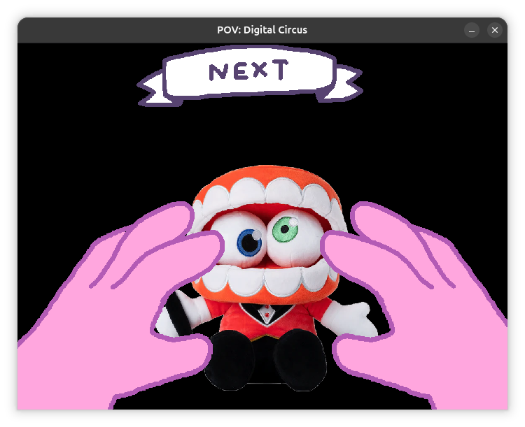

# Pov Digital Circus 


## Requirements
 - g++
 - Raylib
 - Cmake

## Compiling and running 

```bash
git clone https://github.com/FrankSteps/pov-digital-circus
cd pov-digital-circus
make
make run 
```

## Characters 
- Kinger 
- Caine
- Jax (Jaxy)
- Zooble 
- Ragatha
- Bubble
- Pomni  
- Gummigoo
- Queenie 
- Gangle

> Note: Bubble is extremely rare... like, rare as 

## Credits
> Original project:  
https://scratch.mit.edu/projects/1191104157  
Thanks, FUZZIE-WEASEL!

## Assets and Code
- Arts: FUZZIE-WEASEL  
- Code (SB3): FUZZIE-WEASEL  
- Code (C++): Frank Steps  

## Audio
- Music: The Free Design  
- Sound effects: FUZZIE-WEASEL  

## Plushies Images
https://glitchproductions.store/collections/the-amazing-digital-circus
